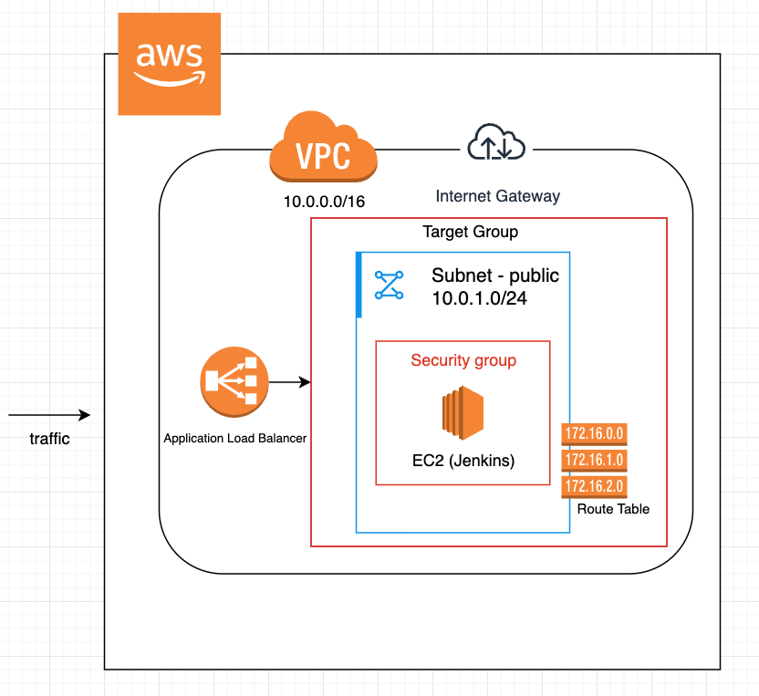

# Jenkins Setup on AWS EC2 with Terraform

This project automates the deployment of a Jenkins server on an AWS EC2 instance using Terraform. It includes the setup of networking components, security groups, a load balancer, and the Jenkins installation process.

## Overview

- **Networking**: Creates a VPC, public and private subnets (not used only for demo purpose), internet gateway, and route tables.
- **Security Groups**: Configures security groups to allow necessary traffic for SSH, HTTP, HTTPS, and Jenkins.
- **Jenkins EC2 Instance**: Provisions an EC2 instance with Jenkins installed, using a user data script.
- **Load Balancer**: Sets up an application load balancer to distribute traffic to the Jenkins instance.
- **Terraform Modules**: Modularizes the infrastructure components for better organization and reusability.

## Usage

1. **Install Terraform**: Ensure Terraform is installed on your machine.
2. **AWS Credentials**: Configure AWS credentials in `~/.aws/credentials` and set the profile to `jenkins`.
    - **Using AWS CLI**:
      1. Install the AWS CLI from the [official website](https://aws.amazon.com/cli/).
      2. Run `aws configure --profile jenkins` and follow the prompts to enter your AWS Access Key ID, Secret Access Key, region, and output format.
    - **Using AWS Toolkit for VS Code**:
      1. Install the AWS Toolkit extension for VS Code from the [Visual Studio Code Marketplace](https://marketplace.visualstudio.com/items?itemName=AmazonWebServices.aws-toolkit-vscode).
      2. Open the AWS Toolkit in VS Code and follow the instructions to add a new AWS profile named `jenkins`.
    - **Create AWS IAM Credentials**:
      1. Sign in to the AWS Management Console.
      2. Navigate to the IAM service.
      3. Create a new user with programmatic access.
      4. Attach the necessary policies to the user.
      5. Save the Access Key ID and Secret Access Key for configuring the AWS CLI or AWS Toolkit.
3. **Initialize Terraform**: Run `terraform init` to initialize the configuration.
4. **Plan**: Run `terraform plan` to preview the changes.
5. **Apply**: Run `terraform apply` to create the infrastructure.

## Accessing Jenkins

After the Terraform apply step is complete, you can access the Jenkins server by copying the output value of `jenkins_load_balancer_dns_name` and pasting it into your web browser.

To route traffic from your subdomain to the load balancer, log in to your domain name provider's management console and navigate to the DNS settings. Add a new A record with the name of your subdomain (e.g., `jenkins.yourdomain.com`) and set the value to the DNS name of your load balancer. Save the changes and allow some time for the DNS propagation.

## Project Structure

- **main.tf**: Defines the main modules for networking, security groups, Jenkins, and load balancer.
- **datasource.tf**: Specifies the data source for the AWS AMI.
- **networking/**: Contains the networking module configuration.
- **security_groups/**: Contains the security groups module configuration.
- **jenkins/**: Contains the Jenkins EC2 instance module configuration.
- **load_balancer/**: Contains the load balancer module configuration.
- **load_balancer_target_group/**: Contains the load balancer target group module configuration.
- **jenkins-runner-script/**: Contains the script to install Jenkins and Terraform on the EC2 instance.
- **outputs.tf**: Defines the outputs for various resources.
- **variables.tf**: Defines the variables used across the configuration.
- **provider.tf**: Configures the AWS provider.

## Outputs

- VPC ID
- Public Subnet IDs
- Public Subnet CIDR Blocks
- Security Group IDs
- Jenkins EC2 Instance ID and Public IP
- SSH Connection String for EC2
- Load Balancer DSN Name

## License

This project is licensed under the MIT License.
